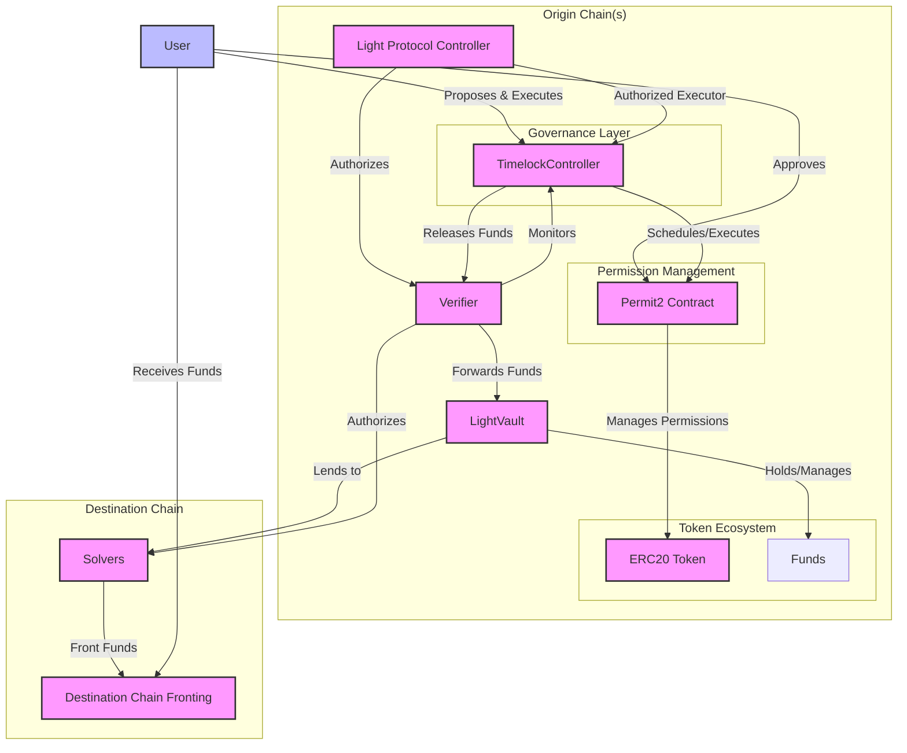

```mermaid
graph TD
    User[User] --> |Approves| Permit2[Permit2 Contract]
    User --> |Proposes & Executes| TimelockController[TimelockController]

    TimelockController --> |Schedules/Executes| Permit2
    Permit2 --> |Manages Permissions| ERC20[ERC20 Token]

    LightProtocolController[Light Protocol Controller] --> |Authorized Executor| TimelockController
    LightProtocolController --> |Authorizes| Verifier[Verifier]

    TimelockController --> |Releases Funds| Verifier
    Verifier --> |Forwards Funds| LightVault[LightVault]

    LightVault --> |Holds/Manages| Funds[Funds]

    Verifier --> |Monitors| TimelockController

    LightVault --> |Lends to| Solvers[Solvers]

    Verifier --> |Authorizes| Solvers

    Solvers --> |Front Funds| DestinationChainFronting[Destination Chain Fronting]

    User --> |Receives Funds| DestinationChainFronting

    subgraph "Origin Chain(s)"
        subgraph "Token Ecosystem"
            ERC20
            Funds
        end

        subgraph "Permission Management"
            Permit2
        end

        subgraph "Governance Layer"
            TimelockController
        end

        LightVault
        LightProtocolController
        Verifier
    end

    subgraph "Destination Chain"
        DestinationChainFronting
        Solvers
    end

    classDef contract fill:#f9f,stroke:#333,stroke-width:2px;
    class Permit2,ERC20,TimelockController,LightProtocolController,LightVault,Verifier,DestinationChainFronting,Solvers contract;

    classDef actor fill:#bbf,stroke:#333,stroke-width:2px;
    class User actor;

    classDef chainBoundary fill:none,stroke:#333,stroke-width:2px,stroke-dasharray: 5 5;
    class OriginChain,DestinationChain chainBoundary;
```
