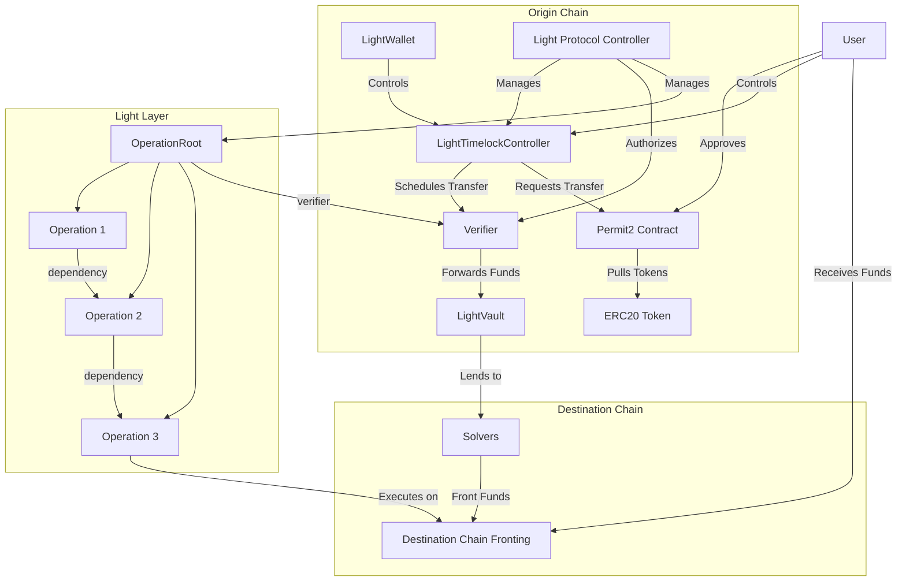

```mermaid
graph TD
    User[User] --> |Approves| Permit2[Permit2 Contract]
    User --> |Controls| LightTimelockController[LightTimelockController]

    LightWallet[LightWallet] --> |Controls| LightTimelockController

    Permit2 --> |Pulls Tokens| ERC20[ERC20 Token]

    LightTimelockController --> |Schedules Transfer| Verifier[Verifier]
    LightTimelockController --> |Requests Transfer| Permit2

    LightProtocolController[Light Protocol Controller] --> |Manages| LightTimelockController
    LightProtocolController --> |Authorizes| Verifier
    LightProtocolController --> |Manages| OperationRoot[OperationRoot]

    Verifier --> |Forwards Funds| LightVault[LightVault]

    LightVault --> |Lends to| Solvers[Solvers]

    Solvers --> |Front Funds| DestinationChainFronting[Destination Chain Fronting]

    User --> |Receives Funds| DestinationChainFronting

    subgraph "Origin Chain"
        ERC20
        Permit2
        LightTimelockController
        Verifier
        LightVault
        LightProtocolController
        LightWallet
    end

    subgraph "Light Layer"
        OperationRoot --> Operation1[Operation 1]
        OperationRoot --> Operation2[Operation 2]
        OperationRoot --> Operation3[Operation 3]

        Operation1 --> |dependency| Operation2
        Operation2 --> |dependency| Operation3

        OperationRoot --> |verifier| Verifier
    end

    subgraph "Destination Chain"
        DestinationChainFronting
        Solvers
    end

    Operation3 --> |Executes on| DestinationChainFronting

```
