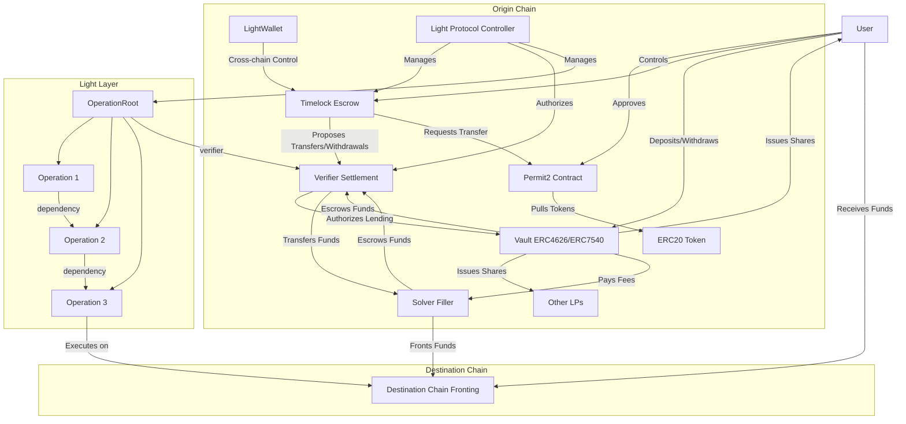

## Roles

### LPs (Liquidity Providers)

- Anyone can deposit and withdraw to the vault in exchange for shares to open up liquidity on a new chain permissionlessly
- Shares can be deposited to a protocol operator for yield generation across chains, and fees will be paid out to the individual LPs (fees will not necessarily accrue to the individual shares)
- Yield generated from the protocol fees can be rebalanced across chains through delegation to the protocol (yield generation)

### Solvers (Fillers)

- Must deposit into one of the LPs (vault) to use as escrow for a particular verifier (tracked independently)
- Must have _sufficient_ escrowed funds for the right to solve the operation (authorized by the verifier for rights to escrow)
- Trusts each verifier to transfer funds to the solver for repayment, and fees are directly received into the vault's funds, in which are authorized by the verifier (operator)

### Vaults (Shares)

- ERC4626 (ERC7540 Vaults) that can escrow funds to a permitted verifier
- Anyone can asynchronously deposit and withdraw to the vault in exchange for shares
- Shares can be freely bought and sold, operator authorizes individual verifiers to lend funds for expectation for fees to be paid to the LPs

### Verifiers (Settlement)

- Individually settled by addresses/contracts pertaining to the verifier
- Verifier is responsible for directly transferring funds to the solver for repayment/disputes (asynchronously or not, completely dependent on verifier logic)
- When borrowing funds, verifier is responsible for authorizing/transferring the funds to the solver for fulfillment

### Timelocks (Escrow)

- Users deposit funds into the vault where it's "assisted self-custody" meaning only users can propose transfers/withdrawals
- Having a timelock means that users have an "on-chain" balance of the chain abstracted funds
- Commonly controlled by a cross-chain smart wallet (such as LightWallet) for easier management and control

### Users (Lenders)

- Through (pre)deposits to the vault through the timelock, users can make fees even smaller, since fees are reimbursed to the vault directly
- Users can choose to lend funds to the protocol through the vault when depositing, in which they receive shares in exchange, and can earn yield on the funds lent
- Deposited shares need to be directly delegated to the protocol operator for immediate use in the protocol (protocol owned if not exited, otherwise deducted from the protocol owned user's balance)

## Key Realizations

- **Capital Efficiency**: Both users and solvers need to deposit into the vault to use as bond(escrow) to the protocol for filling operations, making a common entry point for both to enable maximum capital efficiency for all parties (solvers can flexibly rebalance between vaults across chains of the same verifier / users can lend funds to the protocol through the vault to earn yield and minimize capital opportunity fees)
